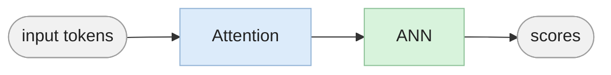

[](https://colab.research.google.com/github/techaarvam/byom_workshop/blob/main/attention_ann_part2_puzzle_solution.ipynb)

*Part of the TechAarvam workshop support files — [Build Your Own Model](https://www.techaarvam.com/workshops/build-your-own-model).*

# Introduce position embedding, residuals and layers

[](https://youtu.be/Hav2zlqxzUI)

▶ **[Watch the 7-minute walkthrough](https://youtu.be/Hav2zlqxzUI)**





```python
import torch

torch.set_printoptions(precision=2, sci_mode=False, linewidth=160)
```

## 1. Word order, layout and vocabulary


### 1.1 Adding word order

In this notebook we are extending the previous notebook, [attention_ann.ipynb](https://colab.research.google.com/github/techaarvam/byom_workshop/blob/main/attention_ann.ipynb), which introduced (plausibly) the world's tiniest hand-constructed transformer model. Please read the previous notebook for the context. This is the solution to the puzzle that was introduced as part of the previous notebook.


We add one word 'disobeys' which modifies the action-attribute words (swap-speech, keep-speech, swap-flight, keep-flight). In the previous notebook the order of the words did not matter. In the current notebook, the order does matter. The word disobeys modifies only the word right after it, so word order matters.

The solution adds an extra layer, and a residual connection that carries the input unmodified to the next block, so each next layer gets both the unmodified input and the modified input.

The residual stream is made 22 bits, where it carries the original inputs and each layer's/head's findings. The most interesting addition is the position information. Each token carries the position where it appears.

This example is constructed to illustrate the ideas. In the real implementation, we do not hand-construct in this manner. Vector embedding and position embedding are often also learned using the training loop and gradient descent. But the hand-construction allows us to see why those blocks and connections exist and how they are helpful to have.


### 1.2 Residual layout

| idx | slot |
| --- | --- |
| 0 | `fly` |
| 1 | `speak` |
| 2 | `swap_fly` |
| 3 | `swap_speak` |
| 4 | `object` |
| 5 | `action_fly` |
| 6 | `action_speak` |
| 7 | `question` |
| 8 | `disobey` |
| 9 | `pos0` |
| 10 | `pos1` |
| 11 | `pos2` |
| 12 | `pos3` |
| 13 | `pos4` |
| 14 | `pos5` |
| 15 | `previous_word_is_disobey` |
| 16 | `object_attribute_fly` |
| 17 | `object_attribute_speak` |
| 18 | `is_swap_attr_fly` |
| 19 | `is_attr_fly_disobeyed` |
| 20 | `is_swap_attr_speak` |
| 21 | `is_attr_speak_disobeyed` |


```python
# The new list of token bits, with the additional word 'disobeys'
idx = {"fly": 0, "speak": 1, "swap_fly": 2, "swap_speak": 3,
       "object": 4, "action_fly": 5, "action_speak": 6, "question": 7, "disobey": 8}

# constants used for bit-slicing and locating the portion of
# the residual we need

# sentence_length is the maximum sentence length, i.e. the number of position slots.
# It is used to name the position slots below, and to build the
# "Disobey Position Finder" head (Wq_P, Wk_P) in layer 1.
position_start, sentence_length = 9, 6   # position one-hot occupies 9 .. 14
previous_word_is_disobey = 15
object_attribute_fly, object_attribute_speak = 16, 17
is_swap_attr_fly, is_attr_fly_disobeyed = 18, 19
is_swap_attr_speak, is_attr_speak_disobeyed = 20, 21
num_bits = 22

slot_names = {v: k for k, v in idx.items()}
slot_names.update({position_start + p: f"pos{p}" for p in range(sentence_length)})
slot_names.update({previous_word_is_disobey: "previous_word_is_disobey",
                   object_attribute_fly: "object_attribute_fly",
                   object_attribute_speak: "object_attribute_speak",
                   is_swap_attr_fly: "is_swap_attr_fly",
                   is_attr_fly_disobeyed: "is_attr_fly_disobeyed",
                   is_swap_attr_speak: "is_swap_attr_speak",
                   is_attr_speak_disobeyed: "is_attr_speak_disobeyed"})

for i in range(num_bits):
    print(f"{i:2} {slot_names[i]}")
```

     0 fly
     1 speak
     2 swap_fly
     3 swap_speak
     4 object
     5 action_fly
     6 action_speak
     7 question
     8 disobey
     9 pos0
    10 pos1
    11 pos2
    12 pos3
    13 pos4
    14 pos5
    15 previous_word_is_disobey
    16 object_attribute_fly
    17 object_attribute_speak
    18 is_swap_attr_fly
    19 is_attr_fly_disobeyed
    20 is_swap_attr_speak
    21 is_attr_speak_disobeyed


### 1.3 Vocabulary


```python
token_to_vector = {
    #                   fly spk swF swS  obj actF actS  q  dis
    "Rock":             [0,  0,  0,  0,   1,  0,  0,  0,  0],
    "Human":            [0,  1,  0,  0,   1,  0,  0,  0,  0],
    "Crow":             [1,  0,  0,  0,   1,  0,  0,  0,  0],
    "Flying superhero": [1,  1,  0,  0,   1,  0,  0,  0,  0],
    "swap-flight":      [0,  0,  1,  0,   0,  1,  0,  0,  0],
    "swap-speech":      [0,  0,  0,  1,   0,  0,  1,  0,  0],
    "keep-flight":      [0,  0,  0,  0,   0,  1,  0,  0,  0],
    "keep-speech":      [0,  0,  0,  0,   0,  0,  1,  0,  0],
    "disobeys":         [0,  0,  0,  0,   0,  0,  0,  0,  1],
    "he-is?":           [0,  0,  0,  0,   0,  0,  0,  1,  0],
}

for tok, bits in token_to_vector.items():
    print(f"{tok:18} {torch.tensor(bits)}")
```

    Rock               tensor([0, 0, 0, 0, 1, 0, 0, 0, 0])
    Human              tensor([0, 1, 0, 0, 1, 0, 0, 0, 0])
    Crow               tensor([1, 0, 0, 0, 1, 0, 0, 0, 0])
    Flying superhero   tensor([1, 1, 0, 0, 1, 0, 0, 0, 0])
    swap-flight        tensor([0, 0, 1, 0, 0, 1, 0, 0, 0])
    swap-speech        tensor([0, 0, 0, 1, 0, 0, 1, 0, 0])
    keep-flight        tensor([0, 0, 0, 0, 0, 1, 0, 0, 0])
    keep-speech        tensor([0, 0, 0, 0, 0, 0, 1, 0, 0])
    disobeys           tensor([0, 0, 0, 0, 0, 0, 0, 0, 1])
    he-is?             tensor([0, 0, 0, 0, 0, 0, 0, 1, 0])


### 1.4 Embed the sentence

$$x_p \;=\; \underbrace{c(t_p)}_{\text{9 content bits}} \;\Vert\; \underbrace{e_p}_{\text{6 position bits}} \;\Vert\; \underbrace{0}_{\text{7 scratch slots}}$$


```python
def embed(sentence):
    X = torch.zeros(len(sentence), num_bits)
    for current_token_position, current_token in enumerate(sentence):
        X[current_token_position, :9] = torch.tensor(token_to_vector[current_token], dtype=torch.float32)
        X[current_token_position, position_start + current_token_position] = 1
    return X


sentence = ["Crow", "disobeys", "keep-flight", "swap-speech", "he-is?"]
X = embed(sentence)
print(X.shape)

for tok, row in zip(sentence, X):
    print(f"{tok:14} {row[:9]}  {row[position_start:position_start + sentence_length]}  {row[previous_word_is_disobey:]}")
```

    torch.Size([5, 22])
    Crow           tensor([1., 0., 0., 0., 1., 0., 0., 0., 0.])  tensor([1., 0., 0., 0., 0., 0.])  tensor([0., 0., 0., 0., 0., 0., 0.])
    disobeys       tensor([0., 0., 0., 0., 0., 0., 0., 0., 1.])  tensor([0., 1., 0., 0., 0., 0.])  tensor([0., 0., 0., 0., 0., 0., 0.])
    keep-flight    tensor([0., 0., 0., 0., 0., 1., 0., 0., 0.])  tensor([0., 0., 1., 0., 0., 0.])  tensor([0., 0., 0., 0., 0., 0., 0.])
    swap-speech    tensor([0., 0., 0., 1., 0., 0., 1., 0., 0.])  tensor([0., 0., 0., 1., 0., 0.])  tensor([0., 0., 0., 0., 0., 0., 0.])
    he-is?         tensor([0., 0., 0., 0., 0., 0., 0., 1., 0.])  tensor([0., 0., 0., 0., 1., 0.])  tensor([0., 0., 0., 0., 0., 0., 0.])


### 1.5 One attention head

$$\operatorname{head}(X)=\operatorname{softmax}\!\left(\frac{(XW_Q)(XW_K)^{\top}}{\sqrt{d_h}}\right)XW_V$$


```python
def softmax(z, dim=-1):
    z = z - z.max(dim=dim, keepdim=True).values
    e = torch.exp(z)
    return e / e.sum(dim=dim, keepdim=True)


def head(X, Wq, Wk, Wv):
    Q, K, V = X @ Wq, X @ Wk, X @ Wv
    A = softmax(Q @ K.T / Wq.shape[1] ** 0.5)
    return A @ V, A
```


## 2. The model at a glance


- **Layer 1.** Object head: `he-is?` asks "are you an object?" and copies the object's attributes. Disobey position finder: every word asks "is the word just before me `disobeys`?" and writes the answer on itself.
- **Layer 2.** `he-is?` asks the flight word and the speech word for their swap bit and for the disobey flag that layer 1 wrote on them. FFN 2 turns the collected bits into the answer.


## 3. Layer 1
### 3.1 Object head


```python
Wq_O = torch.zeros(num_bits, 2); Wq_O[idx["question"]] = torch.tensor([8.0, 0.0])
Wk_O = torch.zeros(num_bits, 2); Wk_O[idx["object"]]   = torch.tensor([1.0, 0.0])
Wv_O = torch.zeros(num_bits, 2); Wv_O[idx["fly"]] = torch.tensor([1.0, 0.0]); Wv_O[idx["speak"]] = torch.tensor([0.0, 1.0])
Wo_O = torch.zeros(2, num_bits); Wo_O[0, object_attribute_fly] = 1; Wo_O[1, object_attribute_speak] = 1

print("Wq_O nonzero rows:", (Wq_O != 0).any(1).nonzero().flatten())
print("Wk_O nonzero rows:", (Wk_O != 0).any(1).nonzero().flatten())
print("Wv_O nonzero rows:", (Wv_O != 0).any(1).nonzero().flatten())
print("Wo_O nonzero cols:", (Wo_O != 0).any(0).nonzero().flatten())
```

    Wq_O nonzero rows: tensor([7])
    Wk_O nonzero rows: tensor([4])
    Wv_O nonzero rows: tensor([0, 1])
    Wo_O nonzero cols: tensor([16, 17])


### 3.2 Disobey position finder


$$\text{score}(p, j) = q_p \cdot k_j = \begin{cases} 1 & j = p-1 \\ 0 & \text{otherwise} \end{cases}$$

In the code the match is 24 instead of 1, so that softmax picks the previous word cleanly.


```python
S = 24.0

Wq_P = torch.zeros(num_bits, sentence_length)
for p in range(1, sentence_length):
    Wq_P[position_start + p, p - 1] = S

#print ("Wq", Wq_P)

Wk_P = torch.zeros(num_bits, sentence_length)
for p in range(sentence_length):
    Wk_P[position_start + p, p] = 1

#print ("Wk", Wk_P)


Wv_P = torch.zeros(num_bits, 1); Wv_P[idx["disobey"], 0] = 1
Wo_P = torch.zeros(1, num_bits); Wo_P[0, previous_word_is_disobey] = 1

# Scores for the sentence: each word (row) matches only the word just before it (column).
print("Q K^T for", sentence)
print((X @ Wq_P) @ (X @ Wk_P).T)
```

    Q K^T for ['Crow', 'disobeys', 'keep-flight', 'swap-speech', 'he-is?']
    tensor([[ 0.,  0.,  0.,  0.,  0.],
            [24.,  0.,  0.,  0.,  0.],
            [ 0., 24.,  0.,  0.,  0.],
            [ 0.,  0., 24.,  0.,  0.],
            [ 0.,  0.,  0., 24.,  0.]])


### 3.3 Layer 1 output

$$\operatorname{FFN}_1(x)=0
\qquad
X_1 = X + \operatorname{head}_O(X)\,W_O^{(O)} + \operatorname{head}_P(X)\,W_O^{(P)}$$


```python
def layer1(X):
    oO, AO = head(X, Wq_O, Wk_O, Wv_O)
    oP, AP = head(X, Wq_P, Wk_P, Wv_P)
    X1 = X + oO @ Wo_O + oP @ Wo_P
    return X1, AO, AP


X1, AO, AP = layer1(X)

print("A_P")
print(AP)
print()
for tok, row in zip(sentence, X1):
    print(f"{tok:14} previous_word_is_disobey={row[previous_word_is_disobey]:.3f}   "
          f"object_attribute_fly={row[object_attribute_fly]:.3f}  "
          f"object_attribute_speak={row[object_attribute_speak]:.3f}")
```

    A_P
    tensor([[0.20, 0.20, 0.20, 0.20, 0.20],
            [1.00, 0.00, 0.00, 0.00, 0.00],
            [0.00, 1.00, 0.00, 0.00, 0.00],
            [0.00, 0.00, 1.00, 0.00, 0.00],
            [0.00, 0.00, 0.00, 1.00, 0.00]])
    
    Crow           previous_word_is_disobey=0.200   object_attribute_fly=0.200  object_attribute_speak=0.000
    disobeys       previous_word_is_disobey=0.000   object_attribute_fly=0.200  object_attribute_speak=0.000
    keep-flight    previous_word_is_disobey=1.000   object_attribute_fly=0.200  object_attribute_speak=0.000
    swap-speech    previous_word_is_disobey=0.000   object_attribute_fly=0.200  object_attribute_speak=0.000
    he-is?         previous_word_is_disobey=0.000   object_attribute_fly=0.986  object_attribute_speak=0.000


## 4. Layer 2
### 4.1 Two heads: Head1 - "get flight attribute" Head2 - "get speech attribute"

Layer 2 has two heads: get flight attribute and get speech attribute.
Usually layers have a similar topology, so two heads are used in both layers.

Could this work be done with a single head, like the action head in the previous notebook? Not with this residual layout. In the previous notebook, one head attended to both action words, and that worked because each action word's own swap bit (`swap_fly` or `swap_speak`) says which attribute it swaps. Here, the disobey information sits in one shared slot, `previous_word_is_disobey`, on both action words. A single head attending to both action words would add the two disobey signals into the same number, and they could no longer be told apart. For example, `Crow disobeys keep-flight swap-speech he-is?` and `Crow keep-flight disobeys swap-speech he-is?` would give exactly the same head output, but the answers are Human and Crow. So we use one head for the flight word and one head for the speech word.


```python
Wq_fly_head = torch.zeros(num_bits, 1); Wq_fly_head[idx["question"], 0] = 8
Wk_fly_head = torch.zeros(num_bits, 1); Wk_fly_head[idx["action_fly"], 0] = 1
Wv_fly_head = torch.zeros(num_bits, 2); Wv_fly_head[idx["swap_fly"]] = torch.tensor([1.0, 0.0]); Wv_fly_head[previous_word_is_disobey] = torch.tensor([0.0, 1.0])

Wq_speak_head = torch.zeros(num_bits, 1); Wq_speak_head[idx["question"], 0] = 8
Wk_speak_head = torch.zeros(num_bits, 1); Wk_speak_head[idx["action_speak"], 0] = 1
Wv_speak_head = torch.zeros(num_bits, 2); Wv_speak_head[idx["swap_speak"]] = torch.tensor([1.0, 0.0]); Wv_speak_head[previous_word_is_disobey] = torch.tensor([0.0, 1.0])

Wo_2 = torch.zeros(4, num_bits)
Wo_2[0, is_swap_attr_fly]        = 1
Wo_2[1, is_attr_fly_disobeyed]   = 1
Wo_2[2, is_swap_attr_speak]      = 1
Wo_2[3, is_attr_speak_disobeyed] = 1

print("Wv_fly_head nonzero rows:  ", (Wv_fly_head != 0).any(1).nonzero().flatten())
print("Wv_speak_head nonzero rows:", (Wv_speak_head != 0).any(1).nonzero().flatten())
print("Wo_2 nonzero cols:         ", (Wo_2 != 0).any(0).nonzero().flatten())
```

    Wv_fly_head nonzero rows:   tensor([ 2, 15])
    Wv_speak_head nonzero rows: tensor([ 3, 15])
    Wo_2 nonzero cols:          tensor([18, 19, 20, 21])


$$X_2 = X_1 + \big[\operatorname{head}_F(X_1)\;\Vert\;\operatorname{head}_S(X_1)\big]\,W_O^{(2)}$$


```python
def layer2_attn(X1):
    oF, AF = head(X1, Wq_fly_head, Wk_fly_head, Wv_fly_head)
    oS, AS = head(X1, Wq_speak_head, Wk_speak_head, Wv_speak_head)
    X2 = X1 + torch.cat([oF, oS], dim=1) @ Wo_2
    return X2, AF, AS


X2, AF, AS = layer2_attn(X1)
q = sentence.index("he-is?")

print("A_F[q]", AF[q])
print("A_S[q]", AS[q])
print()
print("is_swap_attr_fly       ", X2[q, is_swap_attr_fly])
print("is_attr_fly_disobeyed  ", X2[q, is_attr_fly_disobeyed])
print("is_swap_attr_speak     ", X2[q, is_swap_attr_speak])
print("is_attr_speak_disobeyed", X2[q, is_attr_speak_disobeyed])
```

    A_F[q] tensor([0.00, 0.00, 1.00, 0.00, 0.00])
    A_S[q] tensor([0.00, 0.00, 0.00, 1.00, 0.00])
    
    is_swap_attr_fly        tensor(0.)
    is_attr_fly_disobeyed   tensor(1.00)
    is_swap_attr_speak      tensor(1.00)
    is_attr_speak_disobeyed tensor(0.00)


### 4.2 FFN 2

The FFN is shown for completeness, also as a hand-constructed implementation. But for understanding the ideas of attention, position embedding, residuals and the need for layers, this part can be skipped.

Summary: bias values are used carefully to allow distinguishing 0, 1, 2, 3. This provides different ReLU activation levels corresponding to the number of flips. This FFN is a parity finder, while the FFN used in the previous notebook without the disobeys word was an XOR gate. Repeating the note that, in the real implementation, all the weights and biases are learned using gradient descent and the backpropagation algorithm.

$$s_{\text{fly}} = x_{\text{object\_attribute\_fly}} + x_{\text{is\_swap\_attr\_fly}} + x_{\text{is\_attr\_fly\_disobeyed}}
\qquad
s_{\text{speak}} = x_{\text{object\_attribute\_speak}} + x_{\text{is\_swap\_attr\_speak}} + x_{\text{is\_attr\_speak\_disobeyed}}$$

$$\pi(s)=\operatorname{ReLU}(s)-2\operatorname{ReLU}(s-1)+2\operatorname{ReLU}(s-2)-2\operatorname{ReLU}(s-3)$$

$$\pi(0)=0,\quad \pi(1)=1,\quad \pi(2)=0,\quad \pi(3)=1$$


```python
W1 = torch.zeros(num_bits, 8)
b1 = torch.zeros(8)

for r in (object_attribute_fly, is_swap_attr_fly, is_attr_fly_disobeyed):
    W1[r, 0:4] = 1
for r in (object_attribute_speak, is_swap_attr_speak, is_attr_speak_disobeyed):
    W1[r, 4:8] = 1

b1[0:4] = torch.tensor([0.0, -1.0, -2.0, -3.0])
b1[4:8] = torch.tensor([0.0, -1.0, -2.0, -3.0])

W2 = torch.zeros(8, 2)
W2[0:4, 0] = torch.tensor([1.0, -2.0, 2.0, -2.0])
W2[4:8, 1] = torch.tensor([1.0, -2.0, 2.0, -2.0])

print("W1.T\n", W1.T)
print("\nb1", b1)
print("\nW2.T\n", W2.T)
print("\npi:", [float(torch.relu(torch.tensor([s, s - 1.0, s - 2.0, s - 3.0])) @ W2[0:4, 0]) for s in range(4)])
```

    W1.T
     tensor([[0., 0., 0., 0., 0., 0., 0., 0., 0., 0., 0., 0., 0., 0., 0., 0., 1., 0., 1., 1., 0., 0.],
            [0., 0., 0., 0., 0., 0., 0., 0., 0., 0., 0., 0., 0., 0., 0., 0., 1., 0., 1., 1., 0., 0.],
            [0., 0., 0., 0., 0., 0., 0., 0., 0., 0., 0., 0., 0., 0., 0., 0., 1., 0., 1., 1., 0., 0.],
            [0., 0., 0., 0., 0., 0., 0., 0., 0., 0., 0., 0., 0., 0., 0., 0., 1., 0., 1., 1., 0., 0.],
            [0., 0., 0., 0., 0., 0., 0., 0., 0., 0., 0., 0., 0., 0., 0., 0., 0., 1., 0., 0., 1., 1.],
            [0., 0., 0., 0., 0., 0., 0., 0., 0., 0., 0., 0., 0., 0., 0., 0., 0., 1., 0., 0., 1., 1.],
            [0., 0., 0., 0., 0., 0., 0., 0., 0., 0., 0., 0., 0., 0., 0., 0., 0., 1., 0., 0., 1., 1.],
            [0., 0., 0., 0., 0., 0., 0., 0., 0., 0., 0., 0., 0., 0., 0., 0., 0., 1., 0., 0., 1., 1.]])
    
    b1 tensor([ 0., -1., -2., -3.,  0., -1., -2., -3.])
    
    W2.T
     tensor([[ 1., -2.,  2., -2.,  0.,  0.,  0.,  0.],
            [ 0.,  0.,  0.,  0.,  1., -2.,  2., -2.]])
    
    pi: [0.0, 1.0, 0.0, 1.0]


## 5. Forward pass


```python
def forward(sentence):
    X = embed(sentence)
    X1, AO, AP = layer1(X)
    X2, AF, AS = layer2_attn(X1)
    H = torch.relu(X2 @ W1 + b1)
    Y = H @ W2
    return dict(X=X, X1=X1, X2=X2, Y=Y, AO=AO, AP=AP, AF=AF, AS=AS)


word_to_attributes = {
    "Rock":              (0, 0, 0),
    "Human":             (0, 0, 1),
    "Car":               (0, 1, 0),
    "Talking Tow Truck": (0, 1, 1),
    "Crow":              (1, 0, 0),
    "Flying Superhero":  (1, 0, 1),
    "Plane":             (1, 1, 0),
    "Talking Planes":    (1, 1, 1),
}
attributes_to_word = {b: w for w, b in word_to_attributes.items()}


def readout(sentence):
    r = forward(sentence)
    q = sentence.index("he-is?")
    fly, speak = (int(v.round()) for v in r["Y"][q])
    return attributes_to_word[(fly, 0, speak)], r["Y"][q]
```


```python
sentences = [
    ["Human", "disobeys", "keep-flight", "disobeys", "swap-speech", "he-is?"],
    ["Crow", "disobeys", "keep-flight", "swap-speech", "he-is?"],
    ["Crow", "keep-flight", "disobeys", "swap-speech", "he-is?"],
    ["Crow", "disobeys", "keep-flight", "disobeys", "swap-speech", "he-is?"],
]

for s in sentences:
    word, y = readout(s)
    print(f"{' '.join(s):58} {y}  ->  {word}")
```

    Human disobeys keep-flight disobeys swap-speech he-is?     tensor([1.00, 0.98])  ->  Flying Superhero
    Crow disobeys keep-flight swap-speech he-is?               tensor([0.02, 1.00])  ->  Human
    Crow keep-flight disobeys swap-speech he-is?               tensor([0.99, 0.00])  ->  Crow
    Crow disobeys keep-flight disobeys swap-speech he-is?      tensor([0.02, 0.00])  ->  Rock


$$\{\text{Crow},\,\text{disobeys},\,\text{keep-flight},\,\text{swap-speech},\,\text{he-is?}\}$$


```python
a = ["Crow", "disobeys", "keep-flight", "swap-speech", "he-is?"]
b = ["Crow", "keep-flight", "disobeys", "swap-speech", "he-is?"]

print(sorted(a) == sorted(b))
print(readout(a)[0])
print(readout(b)[0])
```

    True
    Human
    Crow


```python
for s in sentences:
    r = forward(s)
    print(" ".join(s))
    print("  A_P")
    for tok, row in zip(s, r["AP"]):
        print(f"    {tok:14} {row}")
    print("  previous_word_is_disobey", r["X1"][:, previous_word_is_disobey])
    q = s.index("he-is?")
    print("  gathered  ", r["X2"][q, [is_swap_attr_fly, is_attr_fly_disobeyed,
                                      is_swap_attr_speak, is_attr_speak_disobeyed]])
    print("  Y         ", r["Y"][q])
    print()
```

    Human disobeys keep-flight disobeys swap-speech he-is?
      A_P
        Human          tensor([0.17, 0.17, 0.17, 0.17, 0.17, 0.17])
        disobeys       tensor([1.00, 0.00, 0.00, 0.00, 0.00, 0.00])
        keep-flight    tensor([0.00, 1.00, 0.00, 0.00, 0.00, 0.00])
        disobeys       tensor([0.00, 0.00, 1.00, 0.00, 0.00, 0.00])
        swap-speech    tensor([0.00, 0.00, 0.00, 1.00, 0.00, 0.00])
        he-is?         tensor([0.00, 0.00, 0.00, 0.00, 1.00, 0.00])
      previous_word_is_disobey tensor([0.33, 0.00, 1.00, 0.00, 1.00, 0.00])
      gathered   tensor([0.00, 1.00, 1.00, 1.00])
      Y          tensor([1.00, 0.98])
    
    Crow disobeys keep-flight swap-speech he-is?
      A_P
        Crow           tensor([0.20, 0.20, 0.20, 0.20, 0.20])
        disobeys       tensor([1.00, 0.00, 0.00, 0.00, 0.00])
        keep-flight    tensor([0.00, 1.00, 0.00, 0.00, 0.00])
        swap-speech    tensor([0.00, 0.00, 1.00, 0.00, 0.00])
        he-is?         tensor([0.00, 0.00, 0.00, 1.00, 0.00])
      previous_word_is_disobey tensor([0.20, 0.00, 1.00, 0.00, 0.00])
      gathered   tensor([0.00, 1.00, 1.00, 0.00])
      Y          tensor([0.02, 1.00])
    
    Crow keep-flight disobeys swap-speech he-is?
      A_P
        Crow           tensor([0.20, 0.20, 0.20, 0.20, 0.20])
        keep-flight    tensor([1.00, 0.00, 0.00, 0.00, 0.00])
        disobeys       tensor([0.00, 1.00, 0.00, 0.00, 0.00])
        swap-speech    tensor([0.00, 0.00, 1.00, 0.00, 0.00])
        he-is?         tensor([0.00, 0.00, 0.00, 1.00, 0.00])
      previous_word_is_disobey tensor([0.20, 0.00, 0.00, 1.00, 0.00])
      gathered   tensor([0.00, 0.00, 1.00, 1.00])
      Y          tensor([0.99, 0.00])
    
    Crow disobeys keep-flight disobeys swap-speech he-is?
      A_P
        Crow           tensor([0.17, 0.17, 0.17, 0.17, 0.17, 0.17])
        disobeys       tensor([1.00, 0.00, 0.00, 0.00, 0.00, 0.00])
        keep-flight    tensor([0.00, 1.00, 0.00, 0.00, 0.00, 0.00])
        disobeys       tensor([0.00, 0.00, 1.00, 0.00, 0.00, 0.00])
        swap-speech    tensor([0.00, 0.00, 0.00, 1.00, 0.00, 0.00])
        he-is?         tensor([0.00, 0.00, 0.00, 0.00, 1.00, 0.00])
      previous_word_is_disobey tensor([0.33, 0.00, 1.00, 0.00, 1.00, 0.00])
      gathered   tensor([0.00, 1.00, 1.00, 1.00])
      Y          tensor([0.02, 0.00])
    


---


### About this file

This notebook is part of the support files for the TechAarvam workshop
**[Build Your Own Model](https://www.techaarvam.com/workshops/build-your-own-model)**.

- Website: <https://www.techaarvam.com>
- Workshop files repository: <https://github.com/techaarvam/byom_workshop>
- YouTube: <https://www.youtube.com/@TechAarvam>

© TechAarvam. You are free to use, copy, modify, share and build on this
material, including for commercial purposes, **provided you credit
TechAarvam** and link back to <https://www.techaarvam.com>. Please keep
this notice with any copy or derivative. Provided as-is, without warranty.
